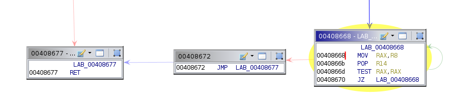
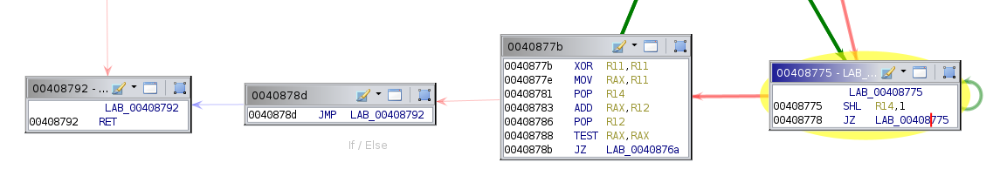

# __Binary and Malware Analysis__
# Challenge 4B

* __Malek Kanaan__
* vunet id : __mkn668__
* Hacker Handle: __Krypt0__

# Introductoion
This argument to the rabbit binary, `-x follow_the_rabbit_dear_consultant`, was supplied to us to further investigate another secret message. However, when used with old DTA tool we get a long message that want me to stop looking. It looks like this:
```Give up a�dCl�o�Celsewhe�e. Nothing is ��dden hereQ. �his �s totallyOnormal.WhoC�re you? Look el�ewhe....```

Clearly this message is a mask that protects the (hidden) second message using the taint washing and other functions.

Using Ghidra, I found an array of 256 functions that starts at `0x408479`. Before this array, an array of addresses to these functions is found at address `0x416520`. This array of 64-bit addresses is used to call the functions and has a certain header structure. For example, the second header entry marks the array's end and the header has 16 byte (2 entries) of nulls to mark its end and the start of the addresses.

# Task 1: CFG-based classification
Starting by the first function in the array at `0x408479`, I follow the execution trying to see whether the taint is getting 'washed' or not. Using Ghidra's `Function Graph` tool, we can see that this function has 11 vertices. By trying to check whether this function could wash the taint or not manually, turns out that this function is not washing the taint but is masking the real value with a new one. So probably generating the fake message. The function after it at `0x4084b4`, however, looks different. It has 10 vertices and a block with itself as a destination a 'self-loop'. First, the function clears a register from taint by moving a constant to it. Then uses clean registers to generate the tainted input value in a loop by incrementing by 1 each iteration. This value is then copied to `%RAX` which is also cleared and then returns. Hence, this function washes the taint and returns the tainted value back.

## Classification based on Number of Nodes in the CFG
By classifying functions by the number of nodes in their graph we find multiple categories. Namely with 7, 8, 9, 10, or 11 vertices. Taking random samples of each of them turns out that only the ones with 10 are washing and the rest are generating fake values. I implemented a classifier based on this observation in a Ghidra script. The script found 128 functions with 10 nodes. These are classified as `WASHER`s the rest are labeled `OTHER`s. This is a trivial classifier that worked, but still seems too coarse grained.

## Classification based on Pattern in the edges in the graph
Looking for an approach with finer granularity, I looked at edge patterns between the function graphs. Noticeably, a subset of the 256 functions has a block with a self reference or 'self-loop`. I wrote a script that classify functions based on this observation. The results included all the washing functions (identified by the number of vertices) but with some graphs with 9 vertices. The 9 vertices functions are interesting. Some of them has 2 self-loops, which is easy to ignore, but some has 1 self-loop which confounds with the washers.

> I wanted to go to a pure edge based solution here so node counts were only for quick sanity check.

The pattern must be more unique to get a correct classification.I noticed that the washer functions always has this self-loop in a block which is one node away from the node with `RET` instruction in it:

<!-- image of the washer -->


While the other functions with 1 self-loop has 2 nodes between a self-referencing node and the return block:
<!-- image of non washer -->


Implementing this observation in the script results in a good classifier. That matches the other node count based approach.

> You can use which CFG approach to use by choosing the either `classifyNodeCount` or `classifyEdgesPattern` inside `classifyFunc()` at line 95.

# Task 2: Dataflow-based classification
I implemented a dataflow-based classifier in Ghidra. The scripts emulate a taint analysis statically. Starting from a tagged `%RDI` with `True`. We loop over the instructions in a certain function. The tag is copied from a tainted operand to another on arithmetic (`ADD`, `SUB`, `XOR`, `OR`, `SHL`, and `SHR`) and `MOV` instructions. The tag is removed if a constant is loaded into a register. To solve the issue of `PUSH` and `POP` instructions I used a stack. When a `PUSH` is encountered, the tag of its operand is pushed into the stack (`True` or `False`). On the other hand, with `POP` the tag is pop'ed from the stack. In the end, we check whether `%RAX` is tagged i.e. has `True` or `False` and classify with `WASHER` if it was not tagged and `OTHER` if it was tagged. This approach works and produces the same result as a CFG approach.

## A DFG Approach can be considered
Another approach might be considered is liveness or reaching definitions analysis based on a Dataflow Graph of a function. However, this is not trivial. First, this approach requires lifting the assembly to IR, having SSA in the IR and then the usage of other structures that are derived from the CFG such as Def-Use chains and Use-Def chains. I do not think this is can be achieved using Ghidra scripting exclusively. Hence, did not do it :).

# Taint Tool changes
Not so much had to be done in the taint tool to behave correctly. Using the setup from assignment 3 as a starting point, the tool had to be aware of the problematic functions. It reads the file produced by the Ghidra scripts classifiers into a `Map`. This map has the address and a boolean. A `true` boolean means this is a `washer`. The `TEST` instruction is instrumented with a callback. The callback has the washer boolean passed as well. When an instrumented `TEST` is reached, the callback copies the taint from `%RDI` to `%RAX` negating the Washing effect. On the other hand, the taint is cleared form `%RDI` so the effect does not affect the message.

# Result
Running the rabbit binary with any analysis we get a new secret message:
```
I imagine thAt right now, you're feeling a bit like Alica, dear mkn668 --
tumbling dOwn the rabbit hole.

I see it in your eyes. You have tHe look of a man who accepts what he sees
because he is expecting to wake up. Ironically, that's not fAr from
tRuth.

.......
.......

All I'm oFfering is the truth. Nothing more. Nothing less.

The chOice is yours, mkn668.
```

# Files Included
* `rabbit` : the binary analyzed (as provided in the assignment).
* `makefile`, `makefile.rules`: required to compile the tool (as provided with prev assignment)
* `tainttool.cpp`: the source code for the tool to perform the analysis and produce the log.
* `assemble_identity.py`: processes the log in `./text/log.txt`,to retrieve the message and puts the recovered message in `./text/secret.txt`. Used in assignment 3.
* `CFG_Analysis.py`: A Ghidra script that performs the CFG based analyses. It implements a edge-based pattern and a node count based pattern. (needs a small source code change to choose).
* `DFA_Analysis`: A Ghidra script that performs a Data Flow Analysis.
* `secret.txt`: This is the new secret found.
* `run_me.sh`: Runs the Ghidra scripts, compiles the tool, run the analysis with PIN, run the python script to recover the secret message using the log file and then prints the secret message.

# Running the Analysis
Simply run the `run_me.sh <analysis>` the analysis can be `cfg` or `dfa` and the patched binaries should appear in the same directory. Make sure that the executables have the correct permissions.

- The `run_me.sh` script assumes that `$GHIDRA_ROOT` and `$PIN_ROOT` variables are present in the environment and points to Ghidra's and PIN root directories respectively.
